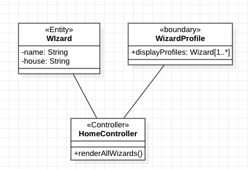
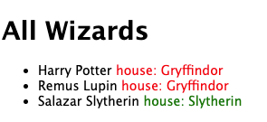
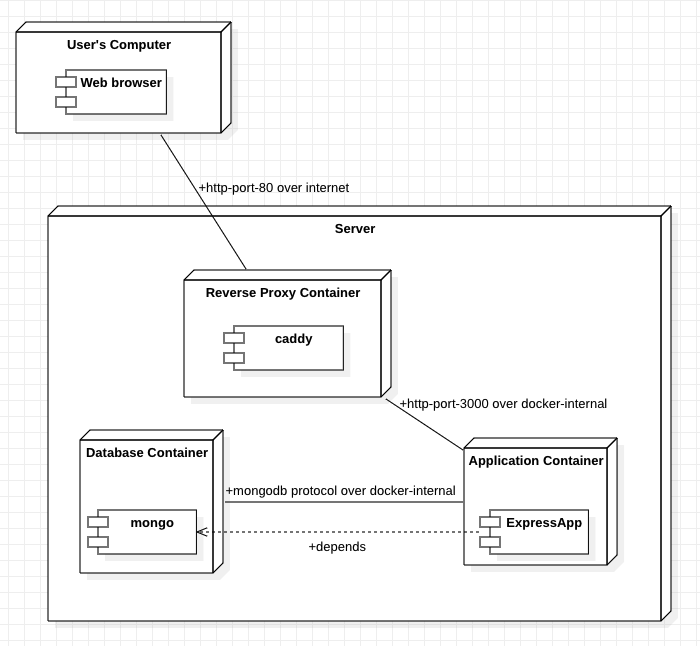

# ExpressJS Views EJS Templates

## Pre Requirements 
- Working Expressjs app generated using the generator. `express --view=ejs <YOUR APP NAME>`
- it runs with `npm start`
- Documentation : https://ejs.co/#docs

## Understanding EJS

Consider this snippet in your view to loop over the `viewModel` passed over from controller. 
This will print the wizard name as a list element. 
```javascript

<% wizards.forEach(function(wizard){ %>
        <li>
          <%= wizard.name %>
        </li>
<% }); %>

```

It also supports conditions 

```javascript

      <% wizards.forEach(function(wizard){ %>
        <li>
          
          <%= wizard.name %>

          
          <% if (wizard.house == "Gryffindor") { %>
           <span style="color:red"> <%= " house: " + wizard.house %></span>
          
          <% } else { %>
            <span style="color:green"> <%= " house: " + wizard.house %></span>
           <% } %> 
        
        
        </li>

      <% }); %>

```

# ExpressJS Database conn

```javascript
const { MongoClient } = require('mongodb');

const url = 'mongodb://mongo:27017/';

const dbName = 'magicWorld';
const client = new MongoClient(url);    
await client.connect();
    console.log('Connected successfully to server');
    const db = client.db(dbName);
    const collection = db.collection('wizards');
    
    // Inserting an object
    const insertResult = await collection.insertMany([{a:1}, {b:2}]);
  
    console.log('Inserted documents =>', insertResult);

    // Filtering documents
    const findResult = await collection.find({}).toArray();
console.log(finalResult);
```


# Deployment 

# Docker Build
Docker Explained https://www.youtube.com/watch?v=_dfLOzuIg2o 
You can run your app using `npm start`, `node bin/www` or similar command. We create a complete Docker

`Dockerfile` is a file used to execute code in a docker container. 
It's a simple text file with instructions required to construct your docker image. 

1. Dockerfile reference : Understanding basic [Dockerfile commands](https://docs.docker.com/build/building/packaging/#dockerfile)
2. Sample dockerfile for nodejs https://nodejs.org/en/docs/guides/nodejs-docker-webapp/ (p.s. if you look at the dockerfile mentioned there, that is your answer! Just change the last line to  `CMD ["node", "./bin/www" ]`)

# Docker Compose
Considering our applications are composed of multiple containers, this tool can define all of these services in a single file. It gives a single command to create, start and stop services. Moreover, an internal network is created when starting a docker compose file. This network is isolated from the network of your machine / server. services in the same docker compose file, can resolve each other's IP inside the internal network. 

## commands:
- `docker compose build` => Build all images in the compose file.
- `docker compose up` => run all images in the compose file in foreground. ( TO close: use CTRL + C)
- `docker compose up -d` => run all images in the compose file in detached mode
- `docker compose down` => stop all running containers that were started from this docker-compose.yml file. 
- `docker compose down --rmi all` => In addition to just the down, this will remove everything related to this docker fie.  Good to have a clean slate.

Here is a good starter docker-compose.yml file. 
Please note: **ONLY EXPOSE PORTS FOR TESTING!** ( by uncommenting the ports section of the yaml file) 
also username and password for mongodb are optional which is a known security vulnerability. 
Adapted from https://github.com/bezkoder/docker-compose-nodejs-mongodb
```yaml
version: "3.8"

services:
  mongo:
    container_name: mongo
    image: mongo:5
    restart: unless-stopped
#    environment:
#      - MONGO_INITDB_ROOT_USERNAME=<SOME USERNAME>
#      - MONGO_INITDB_ROOT_PASSWORD=<SOME PASSWORD>
#     ports:
#       - 27017:27017
    volumes:
      - db:/data/db
  app:
    container_name: app
    depends_on:
      - mongo
    build: ./
    restart: unless-stopped
#     ports:
#       - 3000:3000
    environment:
      - DB_HOST=mongo
      - DB_USER=<SOME USERNAME>
      - DB_PASSWORD=<SOME PASSWORD>
      - DB_NAME=<SOME DB NAme>
      - MONGODB_URL = <COMBINED CONNECTION STRING> 
    stdin_open: true
    tty: true

volumes:
  db:
```

# Reverse Proxy
Instead of directly exposing your application to the internet, it is always a great idea to add a reverse proxy which can serve purposes as load balancer, avaliability indicator, compression, caching, recent httpv2 and v3 support, ability to run multiple domains on a single IP( Shared hosting) etc. Many tools can be used for this : traefik, nginx, apache with mod proxy, however we will be discussing today for it's simplicity. More info about caddy. caddy also has automatic HTTPS for custom URLs, i.e. it will use use ACME protocol with Lets Encrypt service to obtain certificates for your webapps.

## Pre Req
- App is containerized and when ports are exposed, it runs using `docker compose up`
- You have enabled inbound connections to port `80` for your EC2 instance's firewall.

## Adding `caddy` service to your docker compose file
Extend your existing docker compose  file with this service: 

```yaml
version: "3.8"
services:
  caddy:
    image: caddy:latest
    restart: unless-stopped
    ports:
      - "80:80"
    volumes:
      - $PWD/Caddyfile:/etc/caddy/Caddyfile
      - caddy_data:/data
      - caddy_config:/config

volumes:
  caddy_data:
  caddy_config:

```
Essentially, your complete file should look something like: 

```yaml
version: "3.8"

services:
  mongo:
    ...
  app:
    ...
  caddy:
    ...
volumes:
  db:
  caddy_data:
  caddy_config:
```

## Writing your `Caddyfile`
We configure caddy to serve as a reverse proxy for providing https connections. This can be done by adding a text file : `Caddyfile`

```
:80

reverse_proxy app:3000
```

Here: 
- `:80` in line 1 indicates caddy to listen to port 80 which is used as a default port for HTTP protocol.
- `reverse_proxy app:3000` indicated Caddy to act as a Reverse Proxy and forward requests to `app` ( the service name in docker compose) at port 3000
Now doing a docker compose up should make your site online on `http://<Something>.us-east-2.compute.amazonaws.com` or `http://localhost`


# Debugging
## Check caddy works without adding it to docker for now.
1. Install caddy in your EC2 instance
```bash
sudo apt install -y debian-keyring debian-archive-keyring apt-transport-https
curl -1sLf 'https://dl.cloudsmith.io/public/caddy/stable/gpg.key' | sudo gpg --dearmor -o /usr/share/keyrings/caddy-stable-archive-keyring.gpg
curl -1sLf 'https://dl.cloudsmith.io/public/caddy/stable/debian.deb.txt' | sudo tee /etc/apt/sources.list.d/caddy-stable.list
sudo apt update
sudo apt install caddy
```
2. Expose port 3000 and run your docker compose file: `docker compose up -d`
3. test out caddy using command line. `caddy reverse-proxy --from YOUR_PUBLIC_IPV4_DNS:80 --to localhost:3000 `
Note: change `YOUR_PUBLIC_IPV4_DNS` to your `EC2 Public IPv4 DNS` obtained from your AWS Console. It looks something like:
`<Something>.us-east-2.compute.amazonaws.com`
4. Verify you can reach your website at `http://YOUR_PUBLIC_IPV4_DNS`

## (Optional)adding HTTPS `Caddyfile`
We configure caddy to serve as a reverse proxy for providing https connections. This can be done by adding a text file : `Caddyfile`
note this requires you to own a free domain or buy something that you like.

```
example.com

reverse_proxy app:3000
```

Here: 
- make sure your personal domain points to your EC2 IP using `A` DNS record
- `example.com` in line 1 would be replaced with your personal URL obtained from your AWS Console.
- `reverse_proxy app:9000` indicated Caddy to act as a Reverse Proxy and forward requests to `app` ( the service name in docker compose) at port 9000
Now doing a docker compose up should make your site online on `https://<SOmeDomain>`
